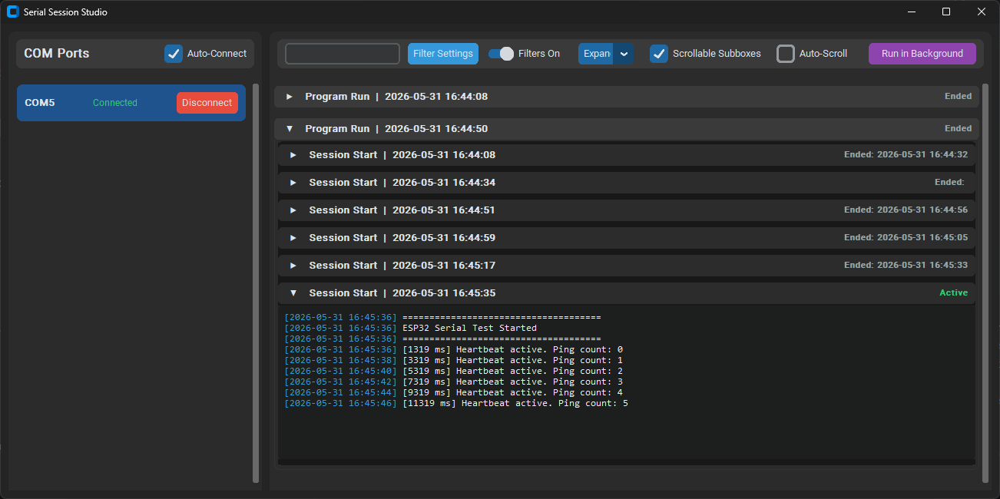

# Serial Logger Studio


The **Serial Logger Studio** is a modern desktop suite built in Python for serial port monitoring, logging, and historical analysis. It provides a robust GUI tailored for tracking multiple COM ports concurrently. 

This tool is designed to handle background connection states, automated disk I/O, and noise-filtering entirely independently, making it perfect for debugging ESP32s via UART, interacting with custom IoT sensors, or working with intricate hardware logic loops.

## 📸 In Action



## 🚀 Features

- **Live Multi-Port Tracking** 
- **Historical Session Rendering**
- **Wildcard Event Filtering**
- **Asynchronous GUI Event Pump**
- **System-Tray Execution**

## 📦 Installation & Setup

If you are cloning the repository to run or modify the application yourself, follow this exact workflow:

1. **Open the Project:** Clone the repository to your local machine.
   ```bash
   git clone https://github.com/LukasKrah/serial-logger-studio
   cd serial-logger-studio
   ```
2. **Create a Virtual Environment:** (Recommended) Set up an isolated environment for the project dependencies.
   ```bash
   python -m venv .venv
   ```
3. **Activate the Environment:** - On Windows:
     ```bash
     .venv\Scripts\activate
     ```
   - On macOS/Linux:
     ```bash
     source .venv/bin/activate
     ```
4. **Install Dependencies:** Install the required Python packages using pip.
   ```bash
   pip install -r requirements.txt
   ```
5. **Launch the Application:** Run the main Python script to start the studio.
   ```bash
   python main.py
   ```
